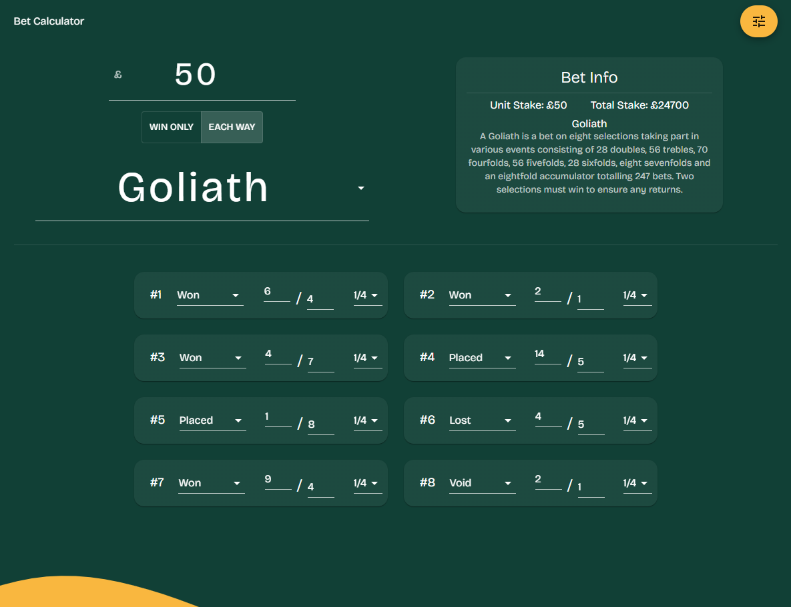
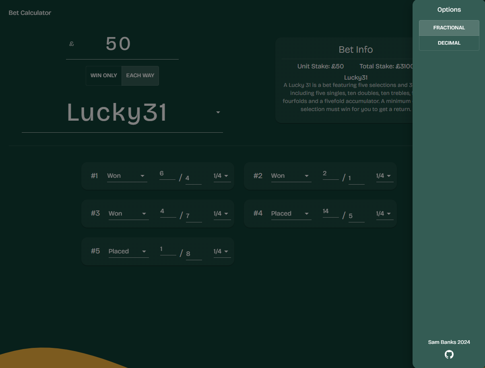
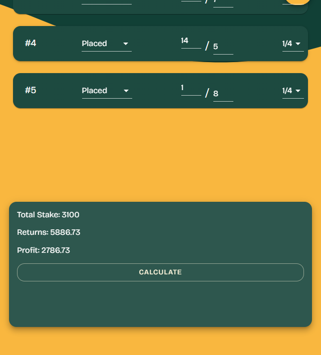

# Bet Calculator

A react frontend for Betcruncher.js by Catena-Media.

## Description

Working for a gambling operator, we regularly use online bet calculators to work out potential returns, check payouts are correct & break down the workings of a wager for clients. 

Betcruncher.js is a bet calculator engine made in javascript (https://github.com/Catena-Media/betcruncher). I wanted an excuse to use React, so used it to make a simple frontend with MUI components.

## To do

- Most of the code is in one file as have spent a lot of time getting used to using MUI. Needs cleaning up and separated into components.
- Add option to apply Rule4 deductions
- Add option to apply accumulator bonuses
- Add ability to add/remove selections for bet types that allow unlimited selections. 
- Error handling... 

Current state of the UI (16/01/24)

Mobile views

